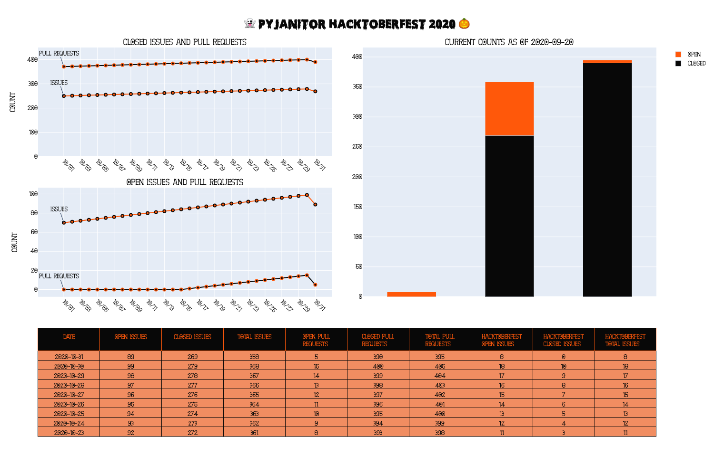

# repo-scrape
> A simple script to scrape a GitHub repository and return statistics on Issues and Pull Requests.

## Notes:
- This was initially created to capture and report progress for [`pyjanitor`](https://github.com/ericmjl/pyjanitor) during Hacktoberfest 2020.
- Contribution is open and welcome.
- A an example of the output is shown below (using fake data):

